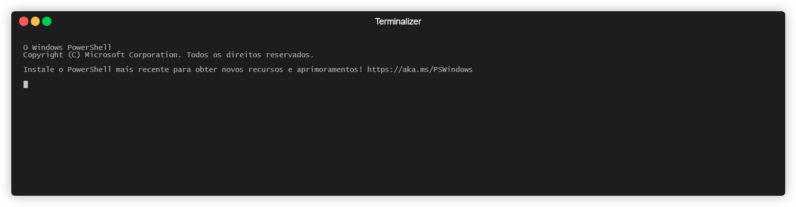
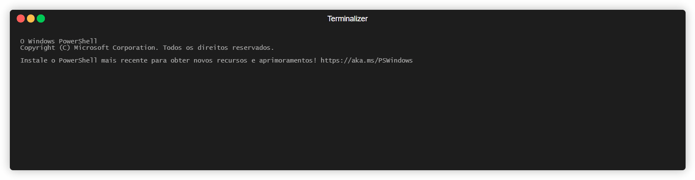

# ZEPA Machine

ZEPA is a simulated machine designed to help you learn aspects of computer organization and operating systems.

## Documentation

Read the [ISA](specs/ISA) and [assembly](specs/assembly) specifications for detailed information about the instruction set architecture and assembly language.

## Demonstration
Usage: go run ./main.go <asm/file/path>"
### Example Program: `add_two_numbers.asm`
``` assembly
_start:
    MV W1, #5       ; Load the number 5 into W1
    MV W2, #3       ; Load the number 3 into W2
    ADD W0, W1, W2  ; Add W1 and W2, result in W0

_end:
    ; End of program
```

In this example, we load the constant value 5 into the register W1, the constant 3 into the register W2, and then add these two values, storing the result in the register W0. Considering that there are 3 instructions, each 4 bytes length, the PC should point to the 12 address position after the execution of this program.



The static image of the result can be found The static image of the result can be found [here](assets/add_two_number.jpeg).

### Example Program: `multiply_two_numbers.asm`
```assembly
_start:
    MV W1, #4       ; Load the number 4 into W1
    MV W2, #6       ; Load the number 6 into W2
    MV W0, #0       ; Initialize W0 with 0, where the result will be stored
    
    ADD W0, W0, W1  ; W0 = W0 + W1 (sum 1st time)
    ADD W0, W0, W1  ; W0 = W0 + W1 (sum 2nd time)
    ADD W0, W0, W1  ; W0 = W0 + W1 (sum 3rd time)
    ADD W0, W0, W1  ; W0 = W0 + W1 (sum 4th time)
    ADD W0, W0, W1  ; W0 = W0 + W1 (sum 5th time)
    ADD W0, W0, W1  ; W0 = W0 + W1 (sum 6th time)

_end:
    ; End of program
```

In this example, we multiply the numbers 4 and 6 by adding 4 a total of 6 times. We initialize the result register W0 to 0, then repeatedly add the value from W1 to W0, effectively achieving multiplication through repeated addition. 

After the execution, W0 will contain the value 24, W1 should have 4, W2 should have 6 and the PC should point to 36




### Example Program: `simple_jump.asm`

```assembly
_start:
    MV W1, #2         ; Move the value 2 into W1
    MV W2, #5         ; Move the value 5 into W2

    JUMP 0x14         ; Jump to address 0x14
    MV W1, #30        ; Move the value 30 into W1 (if no jump)
    MV W2, #40        ; Move the value 40 into W2 (if no jump)

    ; Next position is 0x14
    ADD W0, W1, W2    ; Add W1 and W2, store the result in W0

_end:
    ; End of program
```

In this example, we first load the values 2 and 5 into registers W1 and W2. Then, we jump to another position, ignoring the two next load instructions that would change the final result. This is a simple test for the jump instruction.

If the jump works correctly, the final results should be:

- W1 = 2
- W2 = 5
- W0 = 7

If the jump fails, the registers will incorrectly store the following values:
W1 = 30, 
W2 = 40, 
W0 = 70.


### Example Program: `sub_cmp_bigger.asm`
```assembly
MV W3, #60      ; Move the value 60 into register W3
MV W5, #35      ; Move the value 35 into register W5
SUB W3, W3, W5  ; Subtract the value in W5 from W3 and store in W3
CMP W5, W3      ; Compare the value in W5 with the value in W3
```
First, we load the value 60 into register W3, then load the value 35 into register W5. Next, we subtract W5 from W3 and store the result in W3, resulting in W3 = 25 and W5 = 35. Comparing W3 and W5, find that W5 is greater than W3, which sets the value 2 (second bit is set) in the SR register.


